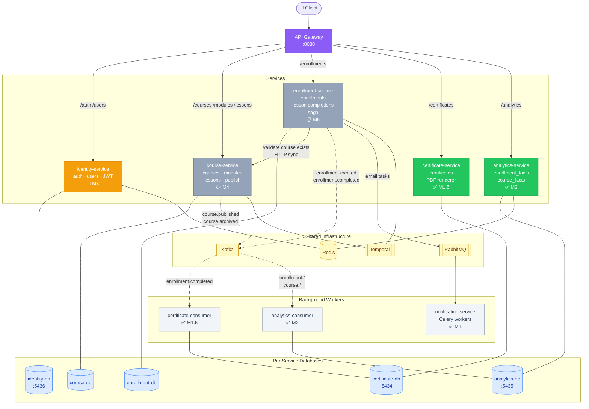
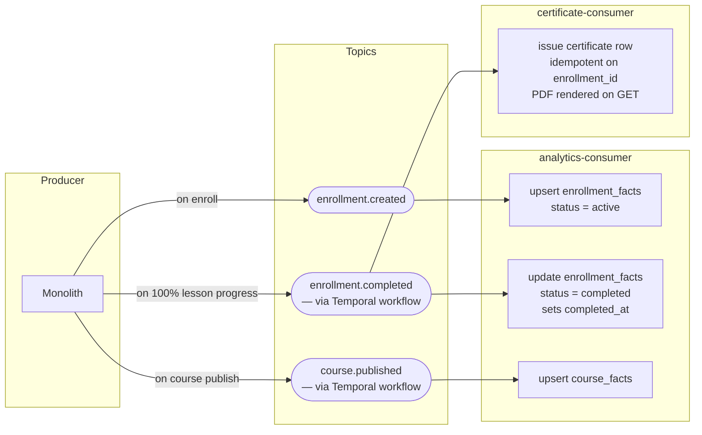
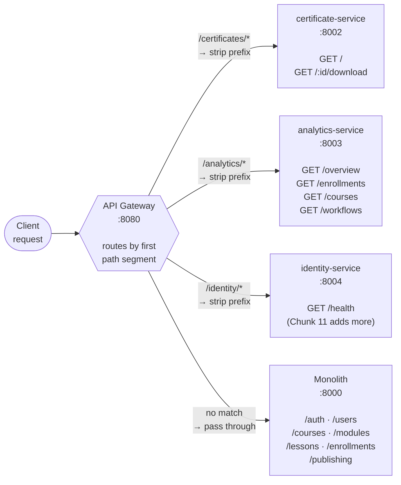

# SmartCourse — Architecture Snapshot

> Current state as of M3 Chunk 10. Updated each milestone.

---

## Diagrams

### Target Architecture — All Services

> ✅ = extracted · 🔧 = skeleton · 📋 = planned
> Solid arrows = sync HTTP · Dashed arrows = async Kafka events



---

### Kafka Event Flows



---

### Gateway Routing



---

## Extraction Status

| Domain | Owns | Status | DB port | API port |
|---|---|---|---|---|
| **Monolith** | auth, users, courses, modules, lessons, enrollments, publishing | Still serving everything not yet cut over | 5433 | 8000 (host) |
| **notification-service** | Celery email workers | ✅ Extracted (M1) | none | — |
| **certificate-service** | certificates table, PDF renderer | ✅ Extracted (M1.5) | 5434 | 8002 |
| **analytics-service** | enrollment_facts, course_facts (read model) | ✅ Extracted (M2) | 5435 | 8003 |
| **identity-service** | users, auth, JWT issuing | 🔧 Skeleton only (Chunk 10) | 5436 | 8004 |
| **course-service** | courses, modules, lessons, publish workflow | 📋 Planned (M4) | — | — |
| **enrollment-service** | enrollments, lesson_completions, saga | 📋 Planned (M5) | — | — |

---

## Request Routing

All public traffic enters through the **API Gateway** on port 8080.
The gateway routes by the **first URL path segment**:

```
Client
  │
  ▼
┌─────────────────────────────────────────────────────┐
│  API Gateway  :8080                                 │
│                                                     │
│  /certificates/* ──strip prefix──► certificate:8002 │
│  /analytics/*    ──strip prefix──► analytics:8003   │
│  /identity/*     ──strip prefix──► identity:8004    │
│  (anything else) ──────────────► monolith:8000      │
└─────────────────────────────────────────────────────┘
```

"Strip prefix" means `/certificates/abc/download` becomes `/abc/download`
on the certificate service. Each service's router has **no URL prefix** of its own.

---

## Service Map

```
                          ┌──────────────────────────────────────────────────┐
                          │                  SHARED INFRA                    │
                          │  Kafka · Schema Registry · Redis · RabbitMQ      │
                          │  Temporal · Jaeger · Prometheus · Grafana        │
                          └────────────────────┬─────────────────────────────┘
                                               │ (all services connect here)
         ┌─────────────────────────────────────┼────────────────────────────────────┐
         │                                     │                                    │
         ▼                                     ▼                                    ▼
┌─────────────────┐                  ┌──────────────────┐               ┌──────────────────────┐
│    MONOLITH     │                  │ notification-svc  │               │   certificate-svc    │
│  host:8000      │──Celery tasks──►│  (Celery worker)  │               │  :8002               │
│                 │                  │  RabbitMQ + Redis │               │  certificate-db:5434 │
│  /auth/*        │                  └──────────────────┘               │                      │
│  /users/*       │                                                      │  consumer:           │
│  /courses/*     │                                                      │  enrollment.completed│
│  /modules/*     │                                                      └──────────────────────┘
│  /lessons/*     │
│  /enrollments/* │                  ┌──────────────────┐               ┌──────────────────────┐
│  /publishing/*  │                  │  analytics-svc   │               │   identity-svc       │
│                 │                  │  :8003           │               │  :8004               │
│  postgres:5433  │                  │  analytics-db    │               │  identity-db:5436    │
└────────┬────────┘                  │  :5435           │               │                      │
         │                           │                  │               │  skeleton only —     │
         │  produces Kafka events     │  consumers:      │               │  no routes yet       │
         │                           │  enrollment.*    │               └──────────────────────┘
         │                           │  course.published│
         └──────────────────────────►│                  │
                                     └──────────────────┘
```

---

## Kafka Event Flows

### Producer
The monolith produces all events today. Future: each extracted service produces its own.

| Topic | Produced by | When |
|---|---|---|
| `enrollment.created` | monolith | student enrolls in a course |
| `enrollment.completed` | monolith (via Temporal `CourseCompletionWorkflow`) | student completes all lessons |
| `course.published` | monolith (via Temporal `PublishCourseWorkflow`) | instructor publishes a course |

### Consumers

| Topic | Consumer service | What it does |
|---|---|---|
| `enrollment.created` | analytics-consumer | upserts row in `enrollment_facts` (status=active) |
| `enrollment.completed` | analytics-consumer | updates `enrollment_facts` row (status=completed, sets completed_at) |
| `enrollment.completed` | certificate-consumer | issues a certificate row (idempotent on enrollment_id) |
| `course.published` | analytics-consumer | upserts row in `course_facts` |

### Avro + Schema Registry
All events use **Confluent wire format**: `[0x00][4-byte schema_id][avro bytes]`.
Each consumer has its own `avro_decoder.py` that fetches the schema from Schema Registry
(`http://schema-registry:8081`) and decodes the payload. No shared library — each
service is independently deployable.

---

## Data Ownership

**Rule:** no service reads another service's database tables. All cross-service
data flows through Kafka events or HTTP calls through the gateway.

| Service | Database | Key tables |
|---|---|---|
| monolith | smartcourse_db (postgres:5433) | users, courses, modules, lessons, enrollments, lesson_completions |
| certificate-service | certificate_db (postgres:5434) | certificates |
| analytics-service | analytics_db (postgres:5435) | enrollment_facts, course_facts |
| identity-service | identity_db (postgres:5436) | *(empty — Chunk 11 moves users here)* |

---

## Auth Flow (current)

JWT tokens are **issued by the monolith** and **validated locally** by each service
using the shared `SECRET_KEY` from the root `.env`.

```
Client ──POST /auth/login──► Gateway ──► Monolith ──issues JWT──► Client

Client ──GET /certificates (Bearer token)──► Gateway
  ──► certificate-service (validates JWT locally with SECRET_KEY)
```

After M3: the monolith's auth endpoints move to identity-service. The local
validation logic stays the same — services still verify JWTs with the shared
secret; they just won't call identity on every request.

---

## What the Monolith Still Owns (cut-over targets)

| Path prefix | Target service | Milestone |
|---|---|---|
| `/auth/*`, `/users/*` | identity-service | M3 |
| `/courses/*`, `/modules/*`, `/lessons/*`, `/publishing/*` | course-service | M4 |
| `/enrollments/*` | enrollment-service | M5 |

---

## Port / URL Quick Reference

| Component | Host port | Docker-internal URL |
|---|---|---|
| API Gateway | 8080 | — |
| Monolith | 8000 | `http://host.docker.internal:8000` |
| certificate-service | 8002 | `http://smartcourse_certificate:8000` |
| analytics-service | 8003 | `http://smartcourse_analytics:8000` |
| identity-service | 8004 | `http://smartcourse_identity:8000` |
| monolith postgres | 5433 | `smartcourse_postgres:5432` |
| certificate-db | 5434 | `certificate-db:5432` |
| analytics-db | 5435 | `analytics-db:5432` |
| identity-db | 5436 | `identity-db:5432` |
| Kafka | 9092 (host) | `kafka:29092` (containers) |
| Schema Registry | 8081 | `schema-registry:8081` |
| Redis | 6379 | `redis:6379` |
| RabbitMQ | 5672 / 15672 | `rabbitmq:5672` |
| Temporal | 7233 | `temporal:7233` |
| Jaeger UI | 16686 | — |
| Grafana | 3001 | — |
| Prometheus | 9090 | — |
